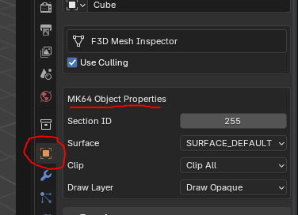

@page objectproperties Object Properties
# Object Properties

## Section ID
* Leave this set to 255. This tells the game to always draw the object.
* If you set this to a section ID, then you need to setup grouped displaylists and consider what meshes should be drawn depending on what section the player is driving in and what direction they are facing.
  * This technology is no longer necessary, and thus, we can ignore it by leaving this value at 255

## Surface
The kind of driving surface the player is on. Dirt and sand will slow you down. Asphalt is driving on a road, etc.

## Clip
This sets if the object can be driven through or not. And if objects in the environment collide with it. Generally, this value only
needs to be changed under certain circumstances
* Remember that the edges of meshes need to perfectly line-up. If there's any gaps, or if objects overlap each other, the collision will not be consistent and players can drive through the object in the corners.

### No Clip
No collision. Players can drive through this object.
* Warning: Setting the surface mesh to no clip will spawn players at 3000.0f because it will not be able to find a place to put the players

### Single-sided Wall
A normal wall collision presuming the player can never access the other side of the wall. If they do, they will drive through the object.

### Surface
Not necessary to be set. But if for some reason you need to force a mesh to be a surface, this is here for that.

### Double-sided Wall
Required if making a fence where the player can access both sides of the wall. The collision generator is not good at recognizing that you want a double-sided wall and for performance reasons will not provide collision for the other side. This means the player can drive through one side, but not the other. Double-sided wall fixes this so no matter what side the wall is approached from, the player cannot drive through the wall.

## Draw Layer
Object draw order matters for transparent objects. Thus, transparent objects must be drawn after opaque objects.

### Draw Invisible
Pretty self-explanatory. The draw phase gets completely cut from the object. This is useful for invisible walls

### Draw Opaque
A normal object. It is not transparent.

### Draw Translucent
A transparent object. If you do not set this for transparent objects, the order of drawn objects will be wrong.

### Draw Translucent NoZBuffer
Objects set to this ignore the ZBuffer. This means they are always visible on the screen, no matter the distance. The HM64 Labs Gizmo grab handles for instance are set to this (used for translating objects).